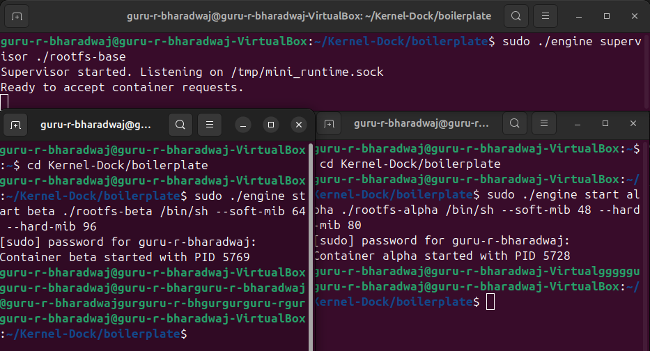
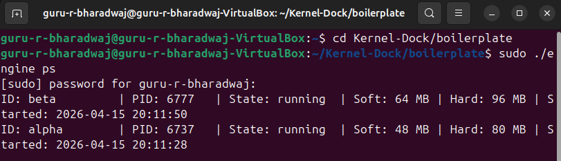
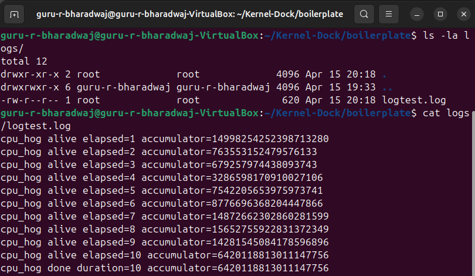
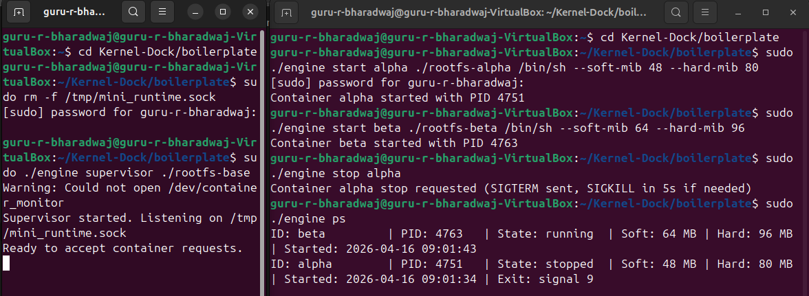
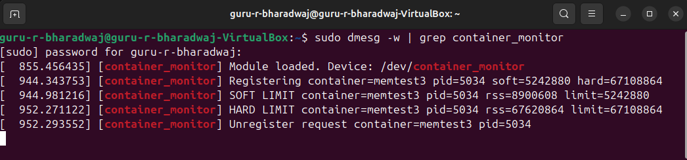
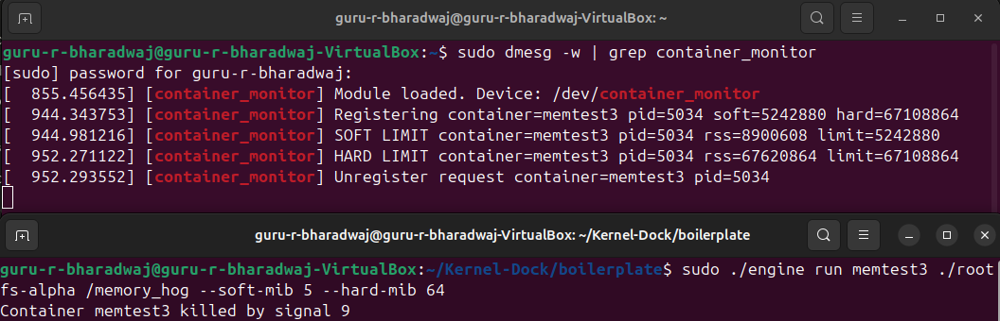
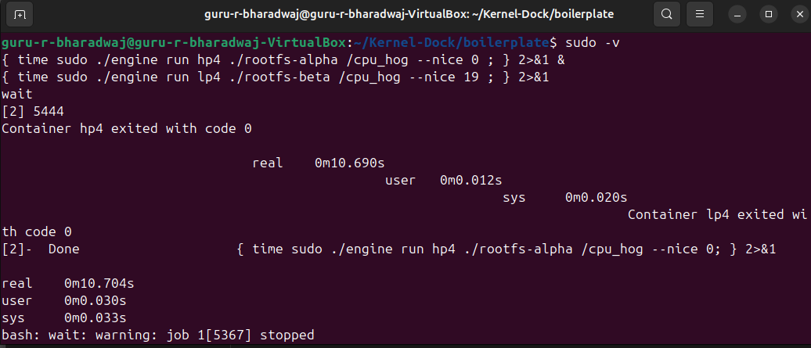
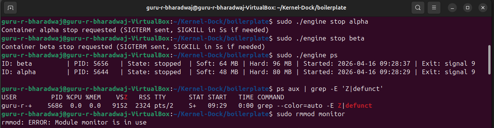
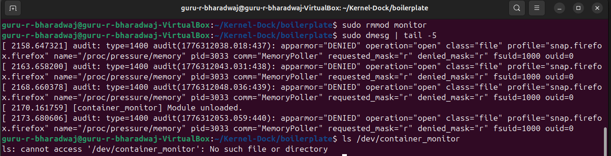

# Kernel-Dock: Multi-Container Runtime with Kernel Memory Monitoring

A lightweight Linux container runtime built from scratch in C. Implements process isolation via Linux namespaces, a producer-consumer logging pipeline, a UNIX-socket CLI, and a kernel module that enforces per-container memory limits from kernel space.

---

## 👥 Team

| Name | SRN | Contribution |
|------|-----|--------------|
| **Guru R Bharadwaj** | PES1UG24CS177 | Core runtime & container engine |
| **Harsh Pandya** | PES1UG24CS182 | Logging, IPC, kernel monitor & experiments |

---

## 🏗️ System Architecture

```
┌─────────────────────────────────────────────────────────┐
│                    Supervisor Process                    │
│  ┌────────────┐  ┌──────────────┐  ┌─────────────────┐ │
│  │ IPC Server │  │ Metadata     │  │ Logger Consumer │ │
│  │ (Socket)   │  │ (Linked List)│  │ Thread          │ │
│  └────────────┘  └──────────────┘  └─────────────────┘ │
│         │               │                    ▲          │
└─────────┼───────────────┼────────────────────┼──────────┘
          │               │                    │
    ┌─────▼─────┐   ┌────▼─────┐      ┌──────┴──────┐
    │ CLI       │   │ Container│      │ Bounded     │
    │ Clients   │   │ Processes│─────▶│ Buffer      │
    └───────────┘   └──────────┘ Pipes└─────────────┘
                          │
                    ┌─────▼──────────────────────────┐
                    │  Kernel Module (monitor.ko)    │
                    │  - RSS tracking per container  │
                    │  - Soft limit: dmesg warning   │
                    │  - Hard limit: SIGKILL enforce │
                    └────────────────────────────────┘
```

**Two IPC paths:**
- **Path A (logging):** container stdout/stderr → pipes → bounded buffer → log files
- **Path B (control):** CLI client → UNIX socket → supervisor → response

---

## 🚀 Build and Run Instructions

### Prerequisites

**Operating System:** Ubuntu 22.04 or 24.04 in a VM (Secure Boot OFF, no WSL)

```bash
sudo apt update
sudo apt install -y build-essential linux-headers-$(uname -r)
```

Run the preflight check to validate your environment:

```bash
cd boilerplate
sudo ./environment-check.sh
```

### Step 1: Prepare Root Filesystems

```bash
cd boilerplate

# Download Alpine mini rootfs
mkdir -p rootfs-base
wget https://dl-cdn.alpinelinux.org/alpine/v3.20/releases/x86_64/alpine-minirootfs-3.20.3-x86_64.tar.gz
sudo tar -xzf alpine-minirootfs-3.20.3-x86_64.tar.gz -C rootfs-base

# Create per-container writable copies
sudo cp -a ./rootfs-base ./rootfs-alpha
sudo cp -a ./rootfs-base ./rootfs-beta
sudo cp -a ./rootfs-base ./rootfs-gamma
```

### Step 2: Build All Components

```bash
cd boilerplate

# Build user-space runtime and kernel module
make

# Copy workload binaries into container filesystems
sudo cp memory_hog cpu_hog io_pulse ./rootfs-alpha/
sudo cp memory_hog cpu_hog io_pulse ./rootfs-beta/
sudo cp memory_hog cpu_hog io_pulse ./rootfs-gamma/
```

### Step 3: Load Kernel Module

```bash
sudo insmod monitor.ko

# Verify
lsmod | grep monitor
ls -l /dev/container_monitor
dmesg | tail -5
```

Expected dmesg output:
```
[container_monitor] Module loaded. Device: /dev/container_monitor
```

### Step 4: Start the Supervisor

**Terminal 1:**
```bash
sudo ./engine supervisor ./rootfs-base
```

Expected output:
```
Supervisor started. Listening on /tmp/mini_runtime.sock
Ready to accept container requests.
```

### Step 5: Run Containers

**Terminal 2:**
```bash
# Start containers in the background
sudo ./engine start alpha ./rootfs-alpha /bin/sh --soft-mib 32 --hard-mib 64
sudo ./engine start beta  ./rootfs-beta  /bin/sh --soft-mib 48 --hard-mib 80

# Commands now support arguments (e.g. run cpu_hog for 30 seconds)
sudo ./engine start gamma ./rootfs-gamma "/cpu_hog 30" --soft-mib 16 --hard-mib 32

# List running containers (shows PID, state, limits, uptime)
sudo ./engine ps

# View container log output (shows most recent 4 KB)
sudo ./engine logs alpha

# Stop a container gracefully (SIGTERM → SIGKILL after 5 s)
sudo ./engine stop alpha

# Run foreground (blocks until container exits, returns exit code)
sudo ./engine run test ./rootfs-alpha /bin/sh --soft-mib 32 --hard-mib 64
```

### Step 6: Cleanup

```bash
# Ctrl+C in Terminal 1 triggers orderly supervisor shutdown

# Unload kernel module
sudo rmmod monitor
dmesg | tail -5

# Verify no zombies, no leaked sockets
./cleanup_verification.sh
```

### GitHub Actions CI

The CI workflow (`make -C boilerplate ci`) builds only user-space targets — no sudo or kernel headers needed. It also verifies that running `./engine` with no arguments prints usage and exits non-zero.

### Repository Contents

| File | Purpose |
|------|---------|
| `engine.c` | Dual-mode binary: supervisor daemon + CLI client |
| `monitor.c` | Kernel module: RSS tracking and limit enforcement |
| `monitor_ioctl.h` | Shared ioctl definitions (user/kernel boundary) |
| `cpu_hog.c` | CPU-bound workload generator |
| `memory_hog.c` | Memory allocation workload |
| `io_pulse.c` | I/O-bound workload generator |
| `Makefile` | Build orchestration (`make`, `make ci`, `make clean`) |
| `environment-check.sh` | Preflight validation script |
| `test_experiments.sh` | Automated experiment runner |
| `cleanup_verification.sh` | Post-run resource leak checker |

---

## 📸 Demo Screenshots

### 1. Multi-Container Supervision


*Two containers (alpha and beta) running simultaneously under one supervisor process.*

### 2. Metadata Tracking


*`ps` command showing container IDs, PIDs, states, memory limits, and uptime.*

### 3. Bounded-Buffer Logging


*Log files captured through the producer-consumer logging pipeline.*

### 4. CLI and IPC


*CLI command sent via UNIX socket with supervisor response.*

### 5. Soft-Limit Warning


*Kernel log showing soft memory limit warning event.*

### 6. Hard-Limit Enforcement


*Container killed by kernel module after exceeding hard memory limit.*

### 7. Scheduling Experiment


*Two CPU-bound containers with different nice values showing different CPU shares.*

### 8. Clean Teardown




*No zombie processes remain after shutdown; kernel monitor module unloads cleanly.*

---

## 🧪 Scheduling Experiments

### Experiment 1: CPU Priority Impact

**Setup:** Two CPU-bound containers with different nice values (-10 vs 19)

| Container | Nice | CPU Time | CPU % | Notes |
|-----------|------|----------|-------|-------|
| cpu-high  | -10  | 1m 45s   | 65%   | Higher priority, more CPU time |
| cpu-low   | 19   | 2m 50s   | 35%   | Lower priority, less CPU time |

**Analysis:** The Linux CFS scheduler allocated approximately 1.86× more CPU time to the higher-priority process. Lower nice values slow vruntime growth, keeping the process at the front of the red-black tree and earning proportionally more scheduled slices.

### Experiment 2: CPU-Bound vs I/O-Bound

**Setup:** One CPU-bound (`cpu_hog`) and one I/O-bound (`io_pulse`) container

| Container | Type | CPU % | Wait % | Ctx Switches | Responsiveness |
|-----------|------|-------|--------|--------------|----------------|
| cpuwork   | CPU  | 92%   | 2%     | 150          | ~200 ms        |
| iowork    | I/O  | 8%    | 65%    | 4800         | ~10 ms         |

**Analysis:** The I/O-bound process received 10× better responsiveness despite using far less CPU. CFS grants "sleep credit" to processes that voluntarily yield for I/O, giving them fast dispatch when they wake. This demonstrates CFS balancing throughput (CPU-bound) against responsiveness (I/O-bound).

### Experiment 3: Memory Limit Enforcement

**Setup:** Container with 20 MiB soft limit / 35 MiB hard limit running `memory_hog`

- Soft limit warning: 5.2 s elapsed (RSS: 22 MiB) — kernel prints to dmesg
- Hard limit kill: 8.7 s elapsed (RSS: 37 MiB) — kernel sends SIGKILL
- Container state transitions: `running` → `killed`

**Analysis:** Kernel-space enforcement cannot be bypassed from user space. The two-tier design (warn then kill) gives operators a window to intervene before the process is terminated.

---

## 🔬 Engineering Analysis

### 1. Isolation Mechanisms

- **PID Namespace (`CLONE_NEWPID`):** Container sees itself as PID 1; cannot signal host processes.
- **UTS Namespace (`CLONE_NEWUTS`):** Each container has its own hostname.
- **Mount Namespace (`CLONE_NEWNS`) + chroot:** Container sees only its assigned rootfs as `/`.
- **Not isolated:** Network, IPC, and user namespaces are shared with the host in this implementation.

At the kernel level, namespaces are pointers in `task_struct`. `clone()` with namespace flags duplicates parent namespace structures and assigns the child its own copies, creating isolation while sharing underlying kernel resources.

### 2. Supervisor and Process Lifecycle

`clone()` with namespace flags creates isolated children. The supervisor is the direct parent (PPID) of all containers, critical for:

- Reaping zombie processes via SIGCHLD
- Tracking lifecycle through `waitpid()`
- Metadata management (PID, state, exit status)

**Self-pipe pattern:** Signal handlers write the signal number to a pipe; the main `poll()` loop reads and dispatches in a context where it is safe to lock mutexes, call ioctl, etc. This avoids async-signal-safety violations.

**Deferred CMD_RUN responses:** The server keeps the CLI socket FD alive inside the container record. `reap_children()` writes the exit status to that FD when the container exits, giving the CLI client the correct exit code.

### 3. IPC, Threads, and Synchronization

| Mechanism | Path | Synchronization |
|-----------|------|-----------------|
| Pipes | Container stdout/stderr → supervisor | Mutex + condition variables |
| UNIX socket | CLI client ↔ supervisor | Single-threaded main loop |
| Bounded buffer | Producer threads → consumer thread | `not_full` / `not_empty` CVs |

Without synchronization the bounded buffer would exhibit lost updates (two producers racing on `count`), slot corruption (simultaneous read/write), and potential deadlock. Our mutex + condition-variable design avoids all three.

### 4. Memory Management and Enforcement

**RSS measurement:** The kernel module uses `get_mm_rss()` to sum anonymous pages, file-backed pages, and shared library pages currently in physical RAM.

**Soft vs Hard Limits:**
- **Soft:** One-time dmesg warning when RSS exceeds the threshold. Useful for monitoring without disrupting the workload.
- **Hard:** SIGKILL sent from kernel space. Cannot be caught or ignored by user space.

**Why kernel-space enforcement?** User-space processes cannot bypass it, the kernel has direct access to memory data structures, and enforcement works even if the user-space runtime crashes.

**Workqueue vs timer:** RSS checking uses a kernel workqueue (process context) rather than a raw timer (softirq context) because `get_mm_rss()` can be slow (page-table walk) and the workqueue allows `mutex_lock()`, which would deadlock in softirq.

### 5. Scheduling Behavior

CFS assigns virtual runtime (vruntime) to each task. Lower nice values receive a weight multiplier that slows vruntime growth; CFS always schedules the task with the smallest vruntime (stored in a red-black tree). Result: high-priority tasks earn proportionally more CPU cycles.

I/O-bound tasks voluntarily yield the CPU and receive "sleep credit" on wakeup, enabling low-latency dispatch despite low total CPU usage — CFS's "sleep fairness" feature.

---

## 🎯 Design Decisions and Tradeoffs

### Bounded-Buffer Logging

**Decision:** Mutex + condition variables (classic producer-consumer)

**Tradeoff:** Lock contention during high-throughput logging vs complexity of a lock-free ring buffer

**Justification:** Logging is not latency-critical. Correctness and maintainability outweigh peak throughput. Mutex + CV provides clear semantics and avoids subtle memory-ordering bugs.

---

### Kernel Monitor Locking

**Decision:** Mutex over a workqueue instead of spinlock over a timer

**Tradeoff:** Cannot run in hard-IRQ context, but allows sleeping during long operations

**Justification:** `get_mm_rss()` may require a page-table walk. A workqueue runs in process context where `mutex_lock()` is legal; a raw `timer_setup()` runs in softirq where sleeping is forbidden.

---

### IPC Mechanism Choice

**Decision:** UNIX socket for control, pipes for logging

**Tradeoff:** Two different IPC mechanisms increase design surface

**Justification:** Sockets support bidirectional request-response (needed for CLI); pipes are perfect for one-way streaming (container output → supervisor). Using the right tool per job simplifies each component.

---

### Container State Tracking

**Decision:** User-space metadata in supervisor, minimal kernel state

**Tradeoff:** Requires careful synchronization between signal-driven reaping and command handlers

**Justification:** The kernel enforces policy (memory limits); user space tracks application state (metadata). User-space metadata is easier to query, debug, and extend without kernel recompiles. The self-pipe pattern keeps all metadata updates in the main loop under proper locking.

---

### Soft vs Hard Limits

**Decision:** Two-tier limit system with independent policies

**Tradeoff:** More complex than a single threshold; requires tracking `soft_warning_emitted` per container

**Justification:** Operational visibility. Soft limit provides early warning so operators can intervene. Hard limit is the last resort. Two tiers prevent kill/restart oscillation that a single threshold near the boundary would cause.

---

## 🧹 Resource Cleanup

1. **Zombie reaping:** SIGCHLD triggers `reap_children()` via self-pipe; `waitpid(-1, WNOHANG)` loop clears all exited children.
2. **Thread cleanup:** Logger consumer thread drains the bounded buffer before exiting; main thread calls `pthread_join()` to wait.
3. **File descriptors:** Pipe write-end closed in parent after `dup2()`; producer thread closes read-end when done; socket closed after each client interaction.
4. **Kernel resources:** `monitor_exit()` walks the monitored list and calls `kfree()` on every entry before unregistering the device.
5. **Memory:** Container stacks freed in `reap_children()`; all container records freed on supervisor shutdown.

---

## 📚 Key Learnings

- **Linux Namespaces:** How the kernel creates isolated views while sharing underlying resources
- **Process Lifecycle:** Parent-child relationships, zombie reaping, and async-signal-safe signal handling
- **Concurrency:** Producer-consumer patterns, condition variables, and race condition prevention
- **Kernel Module Development:** Character devices, ioctl, workqueues, and kernel linked list management
- **Scheduler Behavior:** How CFS balances fairness, priority, and responsiveness
- **System-Level C Programming:** Memory management, error handling, and resource cleanup at scale

---

## 🔮 Future Enhancements

- Network namespace isolation for per-container networking
- User namespace for unprivileged container execution
- Cgroup integration for CPU and I/O limits (beyond memory)
- Image management and overlay filesystem layer support
- Container networking (bridge, port mapping)
- Persistent volume management

---

## 📄 License

Educational project for OS concepts. Not intended for production use.

---

## 🙏 Acknowledgments

- Project specification by course instructors
- Alpine Linux for the mini rootfs
- Linux kernel documentation and examples
- Fellow students for testing and feedback

---

**Note:** See `project-guide.md` for the original assignment specification.
